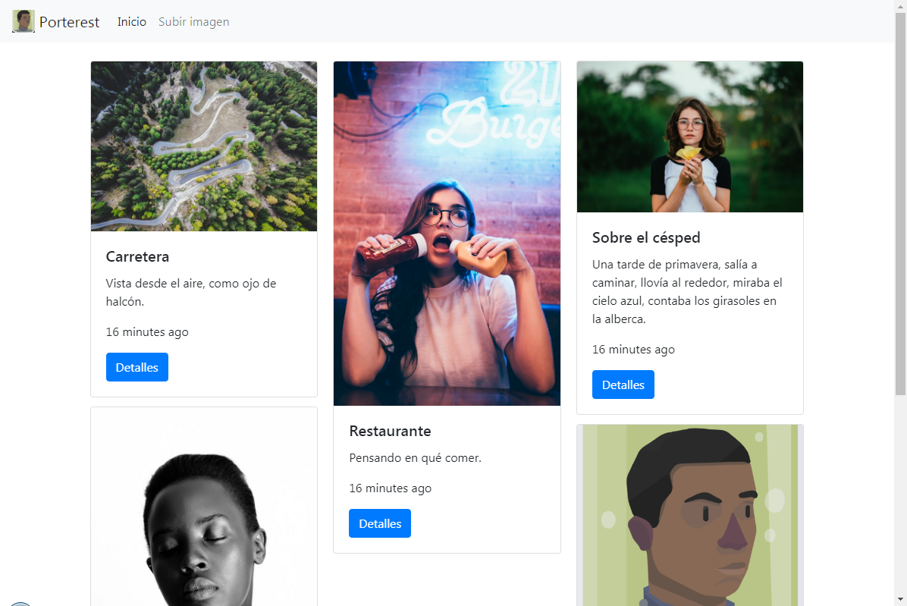
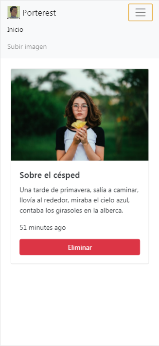
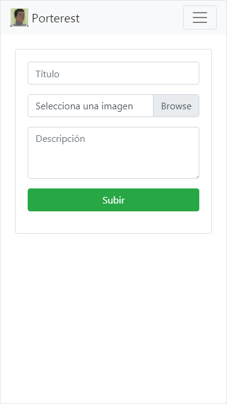

# Porterest [Still in development]


Application for upload images and delete it through of ExpressJS server.

## Installation
Install all dependencies
```
npm install
```
Then run the server
```bash
$ npm run dev
```
>_*Note*: Be sure it starting mongod server with the necessary collections._

## Global access

[https://porterest.now.sh](https://porterest.now.sh)

## Screenshots

#### Desktop view


##### Mobile view



## Modules
* `ejs` Agregar al html lógica
* `express` Framework para el Servidor
* `fs-extra` Es el mismo fs de node pero con Promises
* `mongoose` Conectar y modelar entidades de mongodb
* `morgan` Mostrar en la consolaa lo se va recibiendo en el servidor y lo que los clientes piden al servidor
* `multer` Subir imágenes, permiter desde el servidor la subida de imágenes
* `timeago.js` Convertir las fechas y horas en tiempo transcurridos desde el momento actual
* `uuid` Generar ids por cada imagen subida

### Development
* `nodemon` Update the changes made from the server.

### Libraries
* `Bootstrap 4`
* `Animate.css 3.7`

## Folders structure
* `/src/models` MongoDB's models.
* `/src/public` All resurces it can be access fron browser (js, css, all front end code).
* `/src/routes` Routes used by Server.
* `/src/views` The html pages.

## Database
The database used is `mongodb v4.0.6`.

The application has only a model and the next estructure:

```json
{
    "image": {
        "title": "String",
        "description": "String",
        "filename": "String",
        "path": "String",
        "originalname": "String",
        "mimetype": "String",
        "size": "Number",
        "created_at": "Date <default: Date.now()>"
    }
}
```
> [All photos are free for personal and commercial purposes.](https://www.pexels.com/photo-license/)